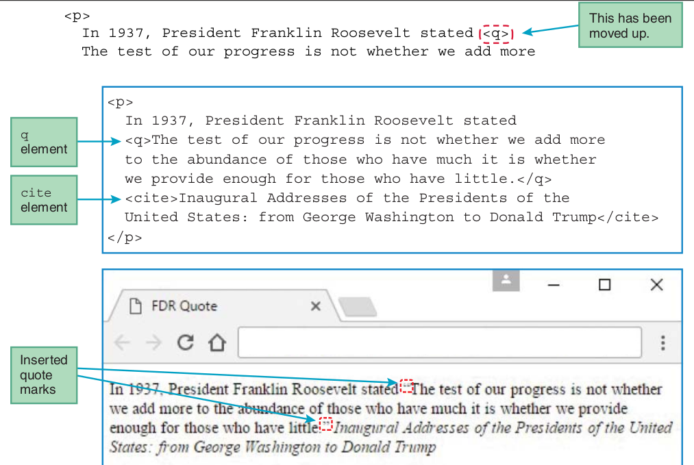
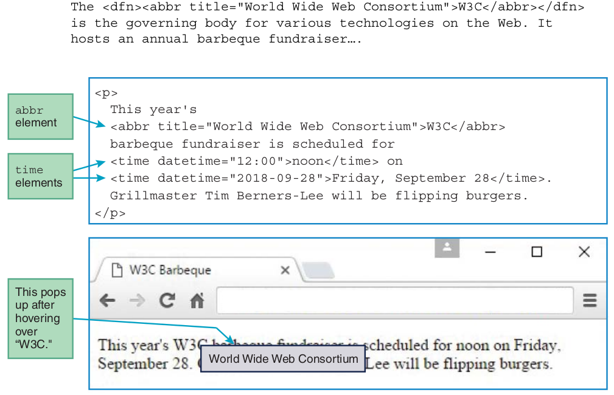
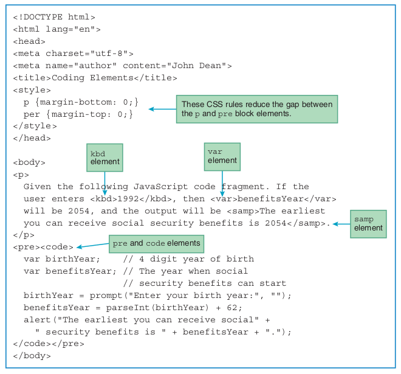
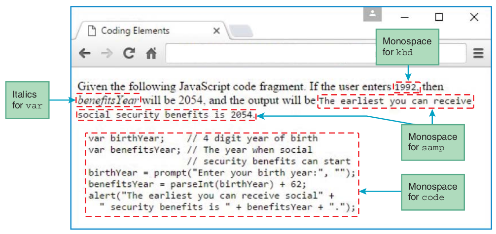
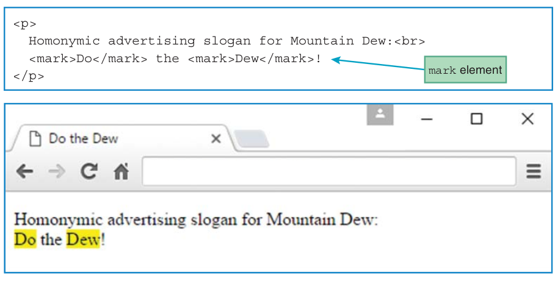
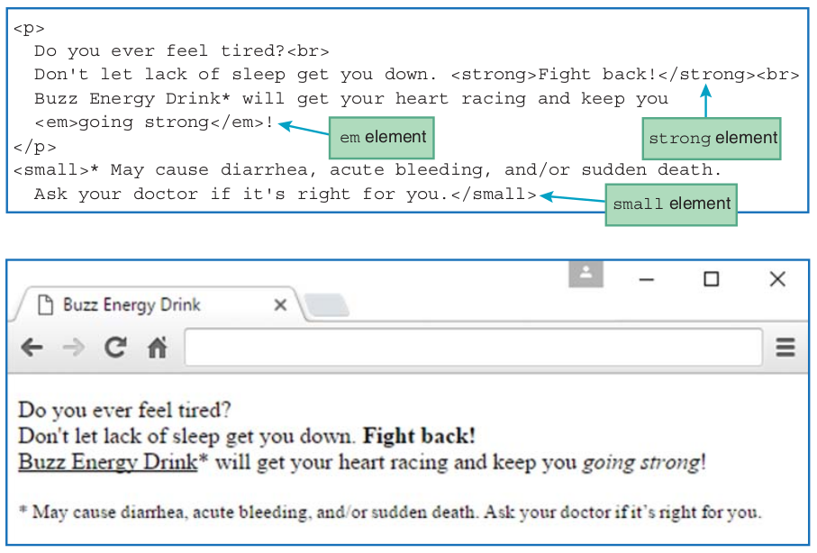
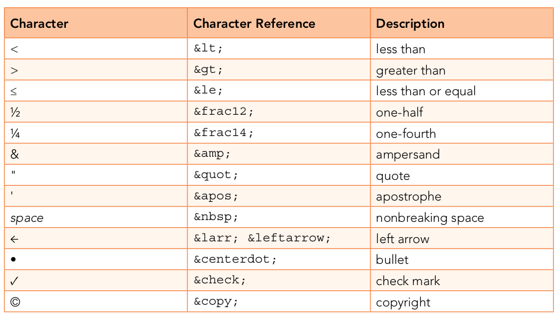

# سم الله الرحمن الرحيم

## Style Rules

For now, it’s OK to remember just the following style rules:
- For every container element, include both a start tag and an end tag. So even though it’s legal to omit a p element’s end tag, don’t do it.
- Use lowercase for all tag names (e.g., meta ) and attributes (e.g., name ).
- Use lowercase for attribute values unless there’s a reason for uppercase. For a meta author element, use title case for the author’s name because that’s how people’s names are normally spelled (e.g., name="Dan Connolly" ).
- For attribute-value assignments, surround the value with quotes, and omit spaces around the equals sign.

The capitalization rule for the doctype instruction is a gray area. Google’s Style Guide says “All code has to be lowercase” except when it’s appropriate for a value to use uppercase. Based on that, <!DOCTYPE html> should be <!doctype html>.

### Comments

```html
<!-- The following image should be updated once a month. -->

```

```html
<!—-
If the user clicks one of the color buttons, that will cause the
following paragraph's font color to change to the button's color.
-->
```

## Block Elements

### `<div>`

### `<p>`

### `<blockquote>`


## Displaying a Web Page Without a Web Server

## Whitespace Collapsing


## `<pre>`

You should use the `<pre>` element for text that needs to have its whitespace preserved. Formally, pre stands for “preformatted text.”

**Demo**
Try the following
```html
HTML is <del>boring.</del><ins>super exciting!</ins>
```

## `<q>`

The q element. It’s for quoted text that is to be rendered within the flow of surrounding text. That’s different from the blockquote element, which spans the width of its container. Normally, browsers display a q element by surrounding its text with quotes.



## `<dfn>`

The `dfn` element is for a word or expression that is to be defined. It’s not for the definition, but rather the thing that is being defined. So, in the following example, dfn tags surround “tooltip,” the word being defined, and not “is a pop-up ...,” which is the definition.

```html
<p>
A <dfn>tooltip</dfn> is a pop-up box that provides information
about the item that the mouse is hovering over.
</p>
```

## `<abr>`

The abbr element is for an abbreviation or acronym.



## `<time>`

```html
<time datetime="2018-09-28">Friday, September 28</time>
<time datetime="12:00">noon</time>
<time datetime="2019-10-01">Tuesday, October 1</time>
<time datetime="04:00">4 AM</time>
Join us for an event <time datetime="2019-01-01T00:00">Study Ubuntu and MySQL</time>
<time>1967-07-15</time>
<time>04:00</time>
```

## Coding Elements Web Page





- Did you notice this?

```css
p {margin-bottom: 0;}
pre {margin-top: 0;}
```

## `br` and `wbr` Elements


## `<mark>` `<strong>` `<em>` `<small>`





## Character References

A character reference is code that you can use in your HTML to display a character that would otherwise be difficult to display. Character references are sometimes called “character entities.”


