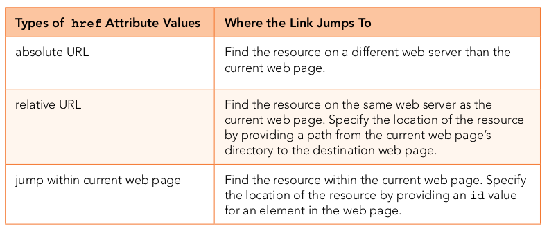
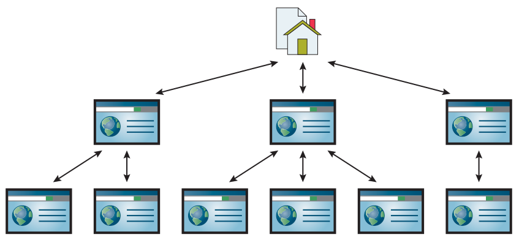
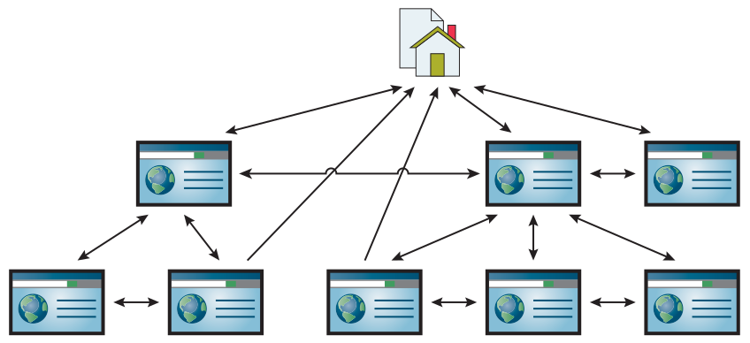
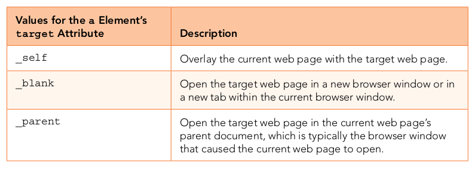
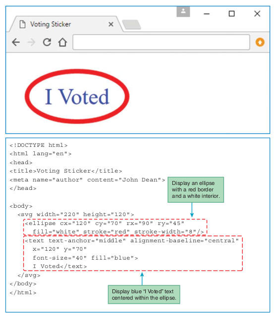
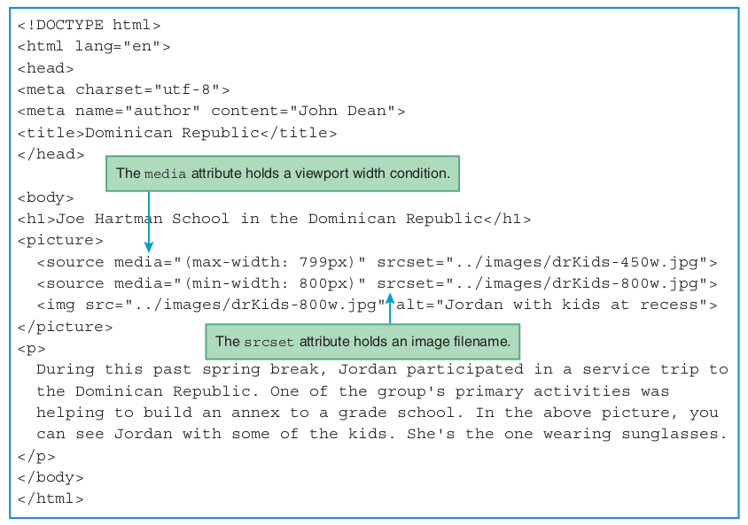

# بسم الله الرحمن الرحيم

## `a` Element

```html
<a href="http://www.park.edu">Park University</a>
```

- Besides enabling a user to load a resource (which usually means jumping to another web page), the a element can be used as a mechanism that enables a user to download a file of any type—image file, video file, PDF file, Microsoft Word file, and so on. To implement that download functionality, include a download attribute as shown here:

```html
<a download href="http://www.park.edu/catalogs/catalog2018-2019.pdf">
Park University 2018-2019 catalog</a>
```



- Example Directory Tree


- Relative Path

```html
<a href="../index.html">Olivia's Home Page</a>
```
```html
<a href="hw1/business.html">Business Page</a>
```
```html
<a href="menu.html">Menu Page</a>
```

- Absolute Path

```html
<a href="/oleung/index.html">Olivia's Website</a>
```
- Web site with linear structure of its web pages


- Web site with hierarchical structure of its web pages


- Web site with mixed structure of its web pages


### Syntax for internal links

```html
<a href="#pledge-drive">Pledge Drive</a>
```

```html
<h3 id="pledge-drive">Pledge Drive</h3>
```

## CSS for Links

```css
a:link {color: color-value;}
a:visited {color: color-value;}
a {text-decoration: none;}
a:hover {text-decoration: underline;}
nav a {font-size: .8em;}
nav > * {margin: 1em 0;}
nav a {cursor: not-allowed;}
```

### Linking to a specified location within different web page

```html
<a href="htmlLecture/clockTower.html#tower-photo">
Park University Clock Tower Photograph</a>
```



```html
<a href="https://www.youtube.com/watch?v=zm48WoRs0hA&noredirect=1"
target="_blank">Bethany Mota: Perfect Back to School Hair, Makeup
&amp; Outfit!</a>
```

## Image Formats

### Bitmap Image Formats

- There are two basic categories of image files—bitmap image files and vector graphics files.
- For a browser to display a bitmap image, it displays each pixel’s mapped color. This reliance on mapping color bit values to pixels is the basis for the name bitmap image.
- The three most common formats for bitmap image files (also called raster image files) on the Web are GIF, JPEG, and PNG.


## `img` Element

```html

```

### SVG


- Displaying an SVG File with an img Element
- Displaying an SVG Code Fragment with an svg Element



## Responsive Images

- users view web pages on different types of platforms—desktops, laptops, tablets, and smartphones.
- Responsive web design (RWD) is the practice of writing code that dynamically generates web pages that conform to different screen sizes and viewing orientations (portrait or landscape).


- <http://usecases.responsiveimages.org> - W3C describes various situations where responsive images are appropriate.

### Responsive Images

- Resolution Switching
- Art Direction

#### Resolution Switching

- *Resolution switching* is when you provide a list of images for different versions of the same picture where the images are identical in terms of aspect ratio
- *aspect ratio* is the ratio of an image’s width to height.

- `sizes`
  - Its value helps the browser choose the most appropriate file from among the `srcset` attribute’s list of image files.
  - provides a comma-separated list of values.
  - Each value has two parts
    - a condition that checks the width of the browser window’s viewport
    - and the width of the slot in which the image displays.
- The **viewport** is the area below the address bar where web page content displays.
  - mobile devices have the smallest viewports
  - laptops and desktop monitors have the largest viewports.


```html
(max-width: 340px) 90vw
```

- The `max width: 340px` condition means that if the device’s viewport is less than or equal to 340 pixels, then the web page uses 90vw for its image slot width.
- The vw unit stands for viewport window, and it’s used for specifying an image slot width as a percentage of the viewport’s width.
- The 90vw value means that the image slot width spans 90% of the viewport’s width.
- the last value in the list serves as the default. If the viewport width does not match any of the prior conditions, then the default image slot width applies.

#### Art Direction

- To implement responsive images with the art direction technique, you wrap the images in a picture container.
- `picture` container holds a group of source elements, where each source element value has two parts
  - condition that checks the width of the browser window’s viewport 
  - and an image filename.



- The source element’s media attribute provides the condition that checks the viewport’s width, and the source element’s srcset attribute provides the image filename.
- In the figure, the first source element uses the condition `max-width: 799px` to check for a viewport width of less than or equal to 799 pixels.
- The second source element uses the condition `min-width: 800px` to check for a viewport width of greater than or equal to 800 pixels.
- In processing a picture element, the browser checks for the first source element whose condition is true and loads that source element’s associated image file.

## Labs

- Lab-01
- Lab-02
- Lab-03