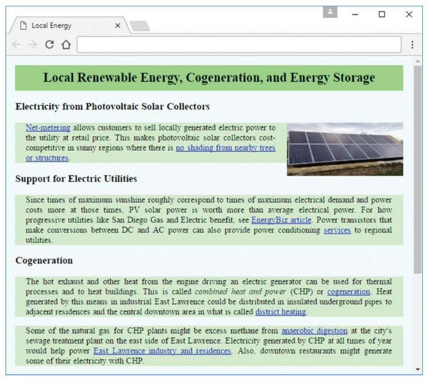

# بسم الله الرحمن الرحيم



- Data

```html
<body>
<h2>Local Renewable Energy, Cogeneration, and Energy Storage</h2>
<section>
<h3>Electricity from Photovoltaic Solar Collectors</h3>

<p>
<a href="http://www.seia.org/policy/distributed-solar/net-metering"
target="_blank">Net-metering</a> allows customers to sell locally
generated electric power to the utility at retail price. This makes
photovoltaic solar collectors cost-competitive in sunny regions
where there is <a href="areaDescription.html">no shading from
nearby trees or structures</a>.
</p>
</section>
<section>
<h3>Support for Electric Utilities</h3>
<p>
Since times of maximum sunshine roughly correspond to times of
maximum electrical demand and power costs more at those times,
PV solar power is worth more than average electrical power. For
how progressive utilities like San Diego Gas and Electric benefit,
see <a href=
"http://www.energybiz.com/magazine/article/325109/dawn-microgrids"
target="_blank">EnergyBiz article</a>. Power transistors that make
conversions between DC and AC power can also provide power
conditioning <a href="services.html">services</a> to regional
utilities.
</p>
</section>
<section>
<h3>Cogeneration</h3>
<p>
The hot exhaust and other heat from the engine driving an electric
generator can be used for thermal processes and to heat buildings.
This is called <em>combined heat and power</em> (CHP) or
<a href="http://en.wikipedia.org/wiki/Cogeneration" target="_blank">
cogeneration</a>. Heat generated by this means in industrial East
Lawrence could be distributed in insulated underground pipes to
adjacent residences and the central downtown area in what is called
<a href="http://en.wikipedia.org/wiki/District_heating" target=
"_blank"> district heating</a>.
</p>
<p>
Some of the natural gas for CHP plants might be excess methane from
<a href="http://www.energy.ca.gov/biomass/anaerobic.html" target=
"_blank"> anaerobic digestion</a> at the city's sewage treatment
plant on the east side of East Lawrence. Electricity generated by
CHP at all times of year would help power
<a href="microgridPossibilities.html#examples">East Lawrence
industry and residences</a>. Also, downtown restaurants might
generate some of their electricity with CHP.
</p>
</section>
<section>
<h3>Energy Storage</h3>
<p>
In summer, electricity generated by PV can
<a href="typicalProperty.html">chill water</a> in storage tanks for
later cooling. This shifts the noon peak in PV generation to the
later peak in consumption. The storage rate can be varied to offset
variations in PV output created by passing clouds. In winter, heat
from CHP making electricity can heat water in (the same) storage
tanks. This transfers excess heat generated in the day when
electricity is most needed to night when heat is most needed.
</p>
<p>
Large low-cost centrally located molten-salt <a
href="http://en.wikipedia.org/wiki/Sodium%E2%80%93sulfur_battery"
target="_blank">sodium-sulfur batteries</a> or room-temperature
<a href="http://www.sciencemag.org/content/349/6255/1529.abstract"
target="_blank">quinone-based flow batteries</a> or smaller
<a href="http://en.wikipedia.org/wiki/Sodium-ion_battery" target=
"_blank">sodium-ion</a> batteries in local shops and restaurants
can smooth variations in load and PV generation and provide
emergency power.
<a href="http://en.wikipedia.org/wiki/Lithium-ion_battery" target=
"_blank">Lithium-ion</a> batteries in electric vehicles can be
wirelessly recharged through inductive coils in <a href=
"http://pluglesspower.com" target="_blank">parking lots</a> or at
<a href="http://www.waveipt.com" target="_blank">bus stops</a>.
</p>
</section>
</body>
```

- Hints

```html
<style>
img {float: right; margin-left: 20px; width: 30%;}
</style>
```

